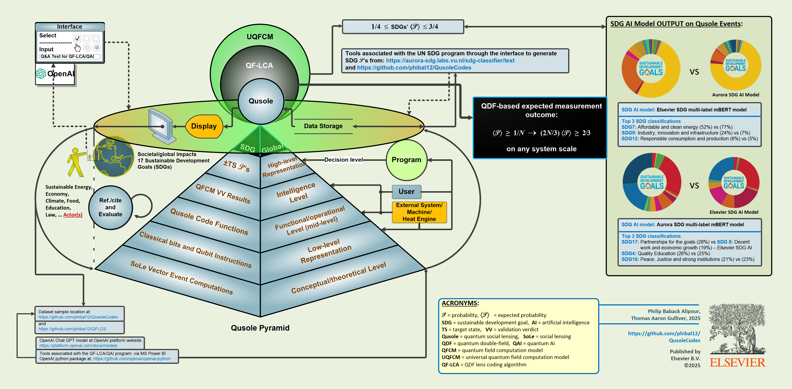

# Qusole CS: Quantum Social Lensing Code Simulator
Technical: [](https://github.com/SoftwareImpacts/SIMPAC-2024-159)
[](https://data.mendeley.com/datasets/gf2s8jkdjf/3)
[](https://codeocean.com/capsule/6853712/tree/v2/code/root/lab/sim/QFLCC%20classifiers/QAI-LCode_QFLCC.py)
[](https://codeocean.com/capsule/6853712/tree/v2/code/root/lab/sim/QFLCC%20classifiers/QDF-LCode_IBMQ-2024-codable.py)
[](https://codeocean.com/capsule/6853712/tree/v2/code/root/lab/sim/QFLCC%20classifiers/QDF-LCode_IBMQ-2024-raw-codable.ipynb)
[](https://codeocean.com/capsule/6853712/tree/v2)
[](https://codeocean.com/capsule/6853712/tree/v2)
[](https://codeocean.com/capsule/6853712/tree/v2)
[](https://codeocean.com/capsule/6853712/tree/v2)
[](https://codeocean.com/capsule/6853712/tree/v2)


Social: [](https://github.com/phibal12)
[](http://ca.linkedin.com/pub/philip-baback-alipour/b/b13/b35)

Academic: [](https://orcid.org/0000-0003-1037-018X)
[](https://www.sciencedirect.com/science/article/pii/S2665963824000915)

Legal: [![CC BY 4.0][cc-by-shield]][cc-by]
<hr/>

This repository contains the code for the Qusole (Quantum Social Lensing) CS (Code Simulator) as an addition (add-on) to the ongoing project of the Quantum Field Lens Coding algorithm, QFLCA (Quantum Field Lens Coding Algorithm).
The QFLCA project repositories are available at https://data.mendeley.com/datasets/gf2s8jkdjf/3 and https://doi.org/10.24433/CO.9905505.v2, which include the code, project website documentation, and demo video files. The status of the current Qaunsole project is: "In Progress"

<kbd>  </kbd> 

The QFLCS program analyzes the measurement outcome probability ($\cal P$) data from datasets generated by Quantum Double-field (QDF) Circuits. The datasets are compared between ES and GS states as a $\cal P$ indicator generated for measurement samples. Small dataset samples denote:

|<kbd>  </kbd>|
|:--:| 
|*An SDG wheel of SDG P Results for the Qusole project in progress ([])*|

- **a)** A particle pair’s energy state in a QDF (different GS states or sublevels of a GS, or see Sec. 3 of the published article), <br>
- **b)** a particle state in an SF, an ES relative to a GS from (a.), prior to its transform into a QDF, and, <br>
- **c)** the expected transformation of fields (ES $\longleftrightarrow$ GS) and their $⟨{\frak M}(\cal{P}, \psi_{ij})⟩$, as in Sec. 3 of the published article.

|<kbd>  </kbd>|
|:--:| 
|*QDF Circuit Measured from a Sum (&nbsp;&Sigma;&nbsp;) of Single Field (SF) to QDF Transformations of Qbit-pairs*|

This repository's file structure is a sample mirror of the Mendeley repository file structure of v3+ at https://data.mendeley.com/datasets/gf2s8jkdjf/3, but with a much smaller file size for efficient download and use of the QFLCA project's code without the documentation (website) and demo video files. Certain small updates have been made in the main python file uploaded on Code Ocean for minor debugging purposes at https://doi.org/10.24433/CO.9905505.v2 or [Code Ocean](https://doi.org/10.24433/CO.9905505.v2). 

* QFLCA project's code without the documentation (website) and demo video files can be found under the <code></code/root/lab/sim/QFLCC classifiers></code> directory in <code></code/root/lab/sim/QFLCC classifiers/docs></code> and <code></code/root/lab/sim/QFLCC classifiers/site></code> folders at https://doi.org/10.24433/CO.9905505.v2 or [Code Ocean](https://doi.org/10.24433/CO.9905505.v2).
* The main file is <code></code/root/lab/sim/QFLCC classifiers/QAI-LCode_QFLCC></code> which imports and executes the <code></code/root/lab/sim/QFLCC classifiers/QDF-LCode_IBMQ-2024-codable></code> or <code>QDF-LCode_IBMQ-2024</code> code for the simulation under Win OS or Linux OS.

|<kbd>  </kbd>|
|:--:| 
|*QInspire QDF Circuit Experiment*|
|&#8597;&nbsp;&nbsp;&nbsp;&nbsp;&nbsp;&nbsp;&#8597;|
|<kbd>  </kbd>|
|*QInspire QDF Circuit Experiment Results*|
|<kbd>  </kbd>|
|*IBM QDF Circuit Experiment*|
|${\color{orange}{In(}} {\color{red}{[\ QInspire\ ,\ IBMQ\ ]\ } }QDF\ Circuit\ {\color{orange}{)&nbsp;&#8594;&nbsp;}} {\color{orange}{QFLCS}} {\color{orange}{&nbsp;&#8594;&nbsp; Out(}}{ {\color{red}{[\ QInspire\ ,\ IBMQ\ ]\ }}  QDF\ Circuit\ Data\ }{\color{orange}{)&nbsp;&#8594;&nbsp; In(}}{\color{green}{QFLCC}}{\color{orange}{)&nbsp;&#8594;&nbsp; Out(&#8628;)}}$|
|<kbd>  </kbd>|
|${\color{red}{[\ QInspire\ ,\ IBMQ\ ]\ }} QDF\ Circuit\ Simulation\ and\ Dataset\ Analysis\ by\ QFLCS\ and\ QFLCC\$|

* We recommend downloading the entire <code><root/...></code> directory according to the folder structure and run <code>[QAI-LCode_QFLCC.py]</code> in VSC with python latest packages installed for Windows OS (the QDF game is developed for Windows OS, yet parts of the code for sound and display can be rewritten for Linux OS), e.g. <code>"winsound"</code> package as a compatible option. Other packages are needed to be installed or code rewritten for <code>"sound"</code> and <code>"display"</code> compatibility under other operating systems.
* The <code>[QAI-LCode_QFLCC.py]</code> file has a Pygame GUI and other packages suited for local machine runs, rather than running this file on the [Code Ocean](https://doi.org/10.24433/CO.9905505.v2) platform which could take hours to compile and run a compatible program/game with packages. 
However, the <code>[QDF-LCode_IBMQ-2024-codable.py]</code> can be run here as the core of the simulation program simulating the QDF circuit. 
A short presentation explaining these points are given in the <code></site/assets/video></code> directory as the <code>[QAI-COcean-Demo.mp4]</code> file from [Code Ocean](https://doi.org/10.24433/CO.9905505.v2).

|<kbd>  </kbd>|
|:--:| 
|*QDF Game Intro from the QFLCA/QFLCS program*|

* The User and Developer's documentation/manual/demo is found under the <code></code/root/lab/sim/QFLCC&nbsp;classifiers></code> directory, as <code><site-prints/...></code> and <code><site/...></code> contents.
* In each folder: <code><QFLCC classifiers/IBMQ>, <.../sim/QAI>, </QFLCC classifiers></code>, and <code><QI/...></code>, under <code></code/root/lab/sim></code>, <code>[Tips.txt]</code> and/or <code>[ReadMe.txt]</code> files exist to explain the contents of that directory. Also, under <code></code/root/lab></code> directory, a ReadMe file exists explaining the manual computation and presentation parts of the project.
  
|<kbd>  </kbd>|
|:--:| 
|*QDF Game Scores on Wins and Losses of the User/Gamer based on the Input Samples by the QFLCS*|

* Graphical Abstract files can be accessed from <code></code/root></code>.

# Visual Project Summary
The QFLCA project is going through stages of development resulting in software products, such as QFLCC and QFLCS programs. These products have been summarized in form of peer-reviewed published articles with their corresponding Graphical Abstracts representing this project.    

* The following figure is a downloadable High-Res Graphical Abstract of the published QFLCS article in Software Impacts, Elsevier BV, at: https://www.sciencedirect.com/science/article/pii/S2665963824000915
 
|<kbd>  </kbd>|
|:--:| 
|*Graphical Abstract of Qusole*|

* The following figure, is a downloadable High-Res Graphical Abstract of the published QFLCA article in Data in Brief, Elsevier BV, at: https://www.sciencedirect.com/science/article/pii/S2352340924007546

|<kbd>  </kbd>|
|:--:| 
|*Graphical Abstract of QFLCA Dataset*|

* The following figure is a downloadable High-Res Graphical Abstract of the published QFLCA article in MethodsX, Elsevier BV, at: https://www.sciencedirect.com/science/article/pii/S221501612300136X

|<kbd>  </kbd>|
|:--:| 
|*Graphical Abstract of QFLCA Model and Method*|


<svg width="100" height="100" xmlns="http://www.w3.org/2000/svg">
<foreignObject width="100" height="100">
    <div xmlns="http://www.w3.org/1999/xhtml">
        <ul>
            <li>text</li>
        </ul>
        <!-- Other embed HTML element/text into SVG -->
    </div>
</foreignObject>
</svg>

[](https://raw.githack.com/phibal12/QusoleCodes/2b10633ab4744a91de128edd6d0d76be8eef2b18/Qusole_SDGs.html)

<script src="https://aurora-sdg.labs.vu.nl/resources/widget.js" type="text/javascript"></script>

# Citation
If you find this repository useful in your research, please cite one or both of the following articles as: 
<hr />

- P. B. Alipour, T. A. Gulliver,
QF-LCA Dataset: Quantum Field Lens Coding Algorithm for System State Simulation and Strong Predictions, Data in Brief, Eslevier BV,
2024, 110789, ISSN 2352-3409, https://doi.org/10.1016/j.dib.2024.110789.

```
@article{110789, 
author = {Alipour, P.B. and Gulliver, T.A.},  
title = {QF-LCA Dataset: Quantum Field Lens Coding Algorithm for System State Simulation and Strong Predictions}, 
journal = {Data in Brief, Eslevier BV}, 
year = {2024}, 
artnum = {110789}, 
doi = {10.1016/j.dib.2024.110789}, 
url = {https://www.sciencedirect.com/science/article/pii/S2352340924007546} 
}
```

- P. B. Alipour, T. A. Gulliver,
QF-LCS: Quantum Field Lens Coding Simulator and Game Tool for Strong System State Predictions, Software Impacts, Eslevier BV,
2024, 100703, ISSN 2665-9638, https://doi.org/10.1016/j.simpa.2024.100703.

```
@article{100703, 
author = {Alipour, P.B. and Gulliver, T.A.}, 
title = {QF-LCS: Quantum Field Lens Coding Simulator and Game Tool for strong system state predictions}, 
journal = {Software Impacts, Eslevier BV}, 
pages = {100703}, 
year = {2024}, 
issn = {2665-9638}, 
doi = {doi.org/10.1016/j.simpa.2024.100703}, 
url = {https://www.sciencedirect.com/science/article/pii/S2665963824000915} 
}
```

<hr />

[![CC BY 4.0][cc-by-shield]][cc-by]

This work is licensed under a
[Creative Commons Attribution 4.0 International License][cc-by].

[![CC BY 4.0][cc-by-image]][cc-by]

[cc-by]: http://creativecommons.org/licenses/by/4.0/
[cc-by-image]: https://i.creativecommons.org/l/by/4.0/88x31.png
[cc-by-shield]: https://img.shields.io/badge/License-CC%20BY%204.0-lightgrey.svg
